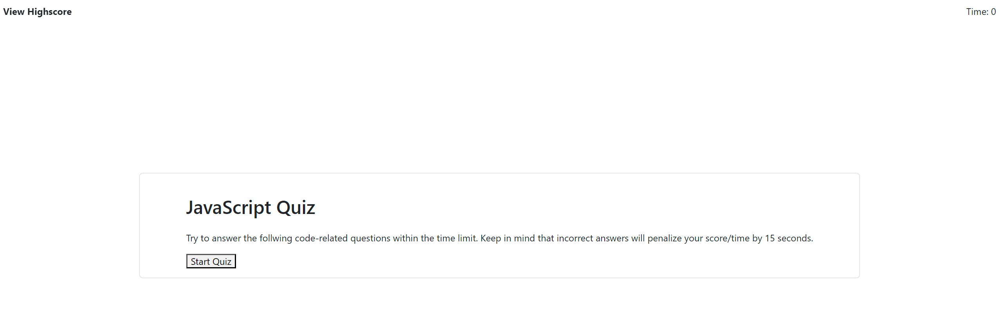

# JS_Quiz

## Description
This is a beginners quiz game built from HTML,CSS, and JavaScript. The game will ask a few questions to the user and collect their score based on their performance.

## How to play 
 - Click the Start button
 - You will have 75 seconds to complete the game
 - Each question is worth 20 points 
 - for each question that is answered incorrectly 15 seconds will be take away
 - The game will end when the Timer reaches 0
 - After you the game ends you will be able to enter your initials and submit your score.
 - You can take a peak at who has the highscore by clicking on "View Highscore link"

## Features
- Interactive quiz game with multiple-choice questions
- Timer countdown to keep track of the remaining time
- Score calculation based on correct answers
- Highscore tracking and display
- Local storage used to persist highscores across sessions
- Responsive design for different screen sizes

## Preview

### Credit 
This code was developed by [Rafael Gomez](https://github.com/Fallen-Master).

### License
This project is licensed under the [MIT License](LICENSE).